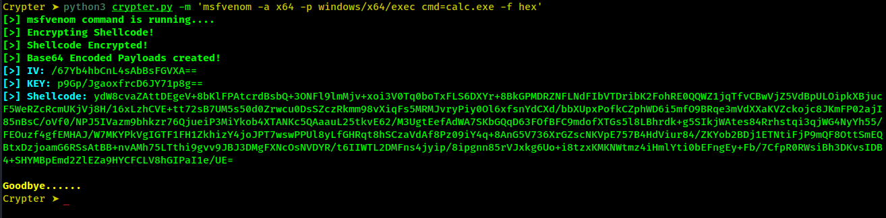

# Simple Python Crypter



---

### Simple python code that encryptes shell code using AES

* Run the script with:

```
python3 crypter.py -m 'msfvenom -a x64 -p windows/x64/exec cmd=calc.exe -f hex'
# Or
python3 crypter.py -H "fc4883e4f0e8c0000000.....4151415052515648"
```

* Help via:

```
python3 crypter.py -h                                                                                                                 
Usage: crypter.py -m msfvenom "command" -f hex
Usage: crypter.py -H "hex string"

Options:
  -h, --help      show this help message and exit
  -H HEX_STRING   Raw hex string format
  -m MSF_COMMAND  Enter the msfvenom command usin -f/--format hex
```
